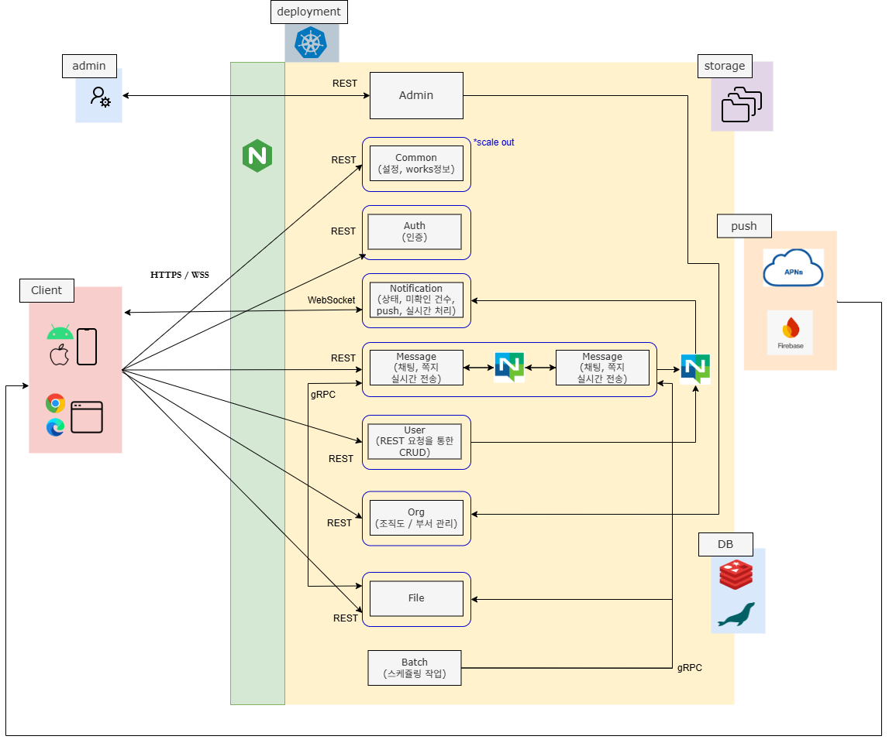

# Goroutine-based High-Concurrency Real-time Messaging Server

## 1. Overview

기존 Java 기반 기업용 메신저는 Single JAR 구조로 운영되면서  
서비스 간 결합도가 높고 일부 기능 변경 시 전체 서비스를 재배포해야 하는  
구조적인 한계가 있었습니다.

이러한 문제를 해결하기 위해 **Go 언어와 Domain-Driven Design (DDD)** 기반으로  
실시간 메시지 전달을 위한 **MSA 메시징 아키텍처**로 재구축한 프로젝트입니다.

WebSocket 세션마다 독립적인 Goroutine을 생성하고  
Channel 기반 비동기 메시지 전달 구조와 Worker Pool 기반  
백그라운드 처리 모델을 적용하여 동시 접속 환경에서도  
안정적인 메시지 처리와 서비스 간 장애 격리가 가능하도록 설계했습니다.

---

# 2. Tech Stack

| Category | Stack |
|--------|------|
| Backend | Go, WebSocket, gRPC |
| Messaging | NATS |
| Database | MariaDB, Redis |
| Infrastructure | Docker |
| Architecture | MSA, DDD |

---

# 3. Key Features

- **Session Isolation & Single Writer Pattern**
  - WebSocket connection마다 독립 Goroutine을 사용하고 Channel 기반 Single Writer Pattern으로 concurrent write 문제 해결

- **Sticky Worker Pool 기반 이벤트 처리**
  - UserHash 기반 sharding으로 worker를 고정하여 Lock 없이 상태 관리
  - Timer 기반 debouncing으로 이벤트 batching 처리

- **Graceful Shutdown 기반 안정적인 리소스 종료**
  - 신규 요청 차단 → Worker job 완료 대기 → 외부 연결 종료 순서로 안전한 서비스 종료

- **NATS 기반 Event-driven 메시징 아키텍처**
  - Pub/Sub 및 Request-Reply 패턴을 통해 서비스 간 이벤트 전달 및 상태 동기화

- **파일 업로드 데이터 정합성 보장**
  - Pre-signed URL + Redis 상태 검증 + gRPC 교차 검증으로 분산 서비스 간 데이터 정합성 확보

---

# 4. System Architecture



---

# 5. WebSocket Session Architecture

WebSocket 기반 실시간 메시징 서버에서는 **Connection 단위의 독립적인 처리 구조와 안전한 메시지 전송 방식**이 중요합니다.

WebSocket Connection은 **Concurrent Write가 안전하지 않기 때문에**,  
여러 Goroutine이 동시에 메시지를 전송할 경우 Race Condition이 발생할 수 있습니다.

이를 해결하기 위해 **Session Isolation + Single Writer Pattern 기반 구조**를 설계했습니다.

## Architecture
```
Client
↓
WebSocket Connection
├── Read Goroutine (Receive Message)
└── Write Goroutine (Send Message)
↑
Session Channel
```


## Design

- **Session Isolation**
  - 각 WebSocket Connection을 독립적인 Goroutine으로 관리하여 세션 단위 처리 구조 구현

- **Read / Write Goroutine 분리**
  - WebSocket Read는 Blocking I/O이기 때문에 Read / Write 처리를 별도의 Goroutine으로 분리

- **Single Writer Pattern**
  - Channel 기반 메시지 전달 구조를 사용하여 WebSocket Write는 단일 Goroutine에서만 수행

## Implementation

- [Connection Lifecycle Goroutine](https://github.com/kipo3195/neo_pjt/blob/541be493b081f18b4450cfe269bbe1dab66db33f/notificator/internal/adapter/http/handler/notificator_service_handler.go#L42-L146)

- [WebSocket Read / Write Handling](https://github.com/kipo3195/neo_pjt/blob/main/notificator/internal/adapter/http/handler/notificator_service_handler.go#L70-L146)

- [Channel 기반 Message Sending](https://github.com/kipo3195/neo_pjt/blob/main/notificator/internal/application/usecase/socket_sender_usecase.go#L38-L41)

## Result

- Concurrent Write 문제 해결
- Connection 단위 장애 격리
- Blocking I/O 영향 최소화

---

# 6. Worker Pool Event Processing

실시간 메시징 환경에서는 **Unread Count와 같은 이벤트가 매우 짧은 시간 동안 반복적으로 발생**할 수 있습니다.

이벤트가 발생할 때마다 즉시 WebSocket 전송을 수행할 경우  
**불필요한 Network I/O 증가와 이벤트 처리 부하**가 발생합니다.

이를 해결하기 위해 **UserHash 기반 Sticky Worker Pool 구조와 Timer 기반 Debouncing 전략**을 적용했습니다.

## Key Points

- **UserHash 기반 Worker Sharding**
  - 동일 사용자의 이벤트를 특정 Worker로 고정 분배
  - Worker 내부에서는 Lock 없이 상태 관리 가능

- **Timer 기반 Debouncing**
  - 이벤트를 일정 시간 동안 모아 배칭 처리
  - WebSocket 전송 횟수 감소

- **Channel 기반 Worker Pool**
  - Dispatcher → Worker 구조로 이벤트 처리 분산

## Implementation

- [Worker Pool 구조](https://github.com/kipo3195/neo_pjt/blob/main/notificator/internal/infrastructure/workerPool/chat_count_worker_pool.go#L1-L262)

- [UserHash 기반 Worker Sharding](https://github.com/kipo3195/neo_pjt/blob/main/notificator/internal/infrastructure/workerPool/chat_count_worker_pool.go#L78-L108)

- [Debouncing Timer 처리](https://github.com/kipo3195/neo_pjt/blob/main/notificator/internal/infrastructure/workerPool/chat_count_worker_pool.go#L110-L180)

## Result

- Network I/O 감소
- Lock-Free 상태 관리
- 이벤트 처리 부하 분산

---

# 7. Graceful Shutdown Lifecycle

컨테이너 기반 환경에서는 서버 종료 시점에 **진행 중인 작업이 중단되거나 데이터 손실이 발생할 수 있습니다.**

이를 방지하기 위해 **Graceful Shutdown 기반 Resource Lifecycle 관리 구조**를 구현했습니다.

## Shutdown Flow
```
SIGTERM / SIGINT
↓
HTTP / gRPC 서버 신규 요청 차단
↓
Worker Pool 진행 중 Job 완료 대기
↓
Redis / NATS / DB 연결 종료
```


## Implementation

- [HTTP / gRPC Shutdown 처리](https://github.com/kipo3195/neo_pjt/blob/main/message/cmd/main.go#L14-L99)

- [Worker Pool Job 완료 대기](https://github.com/kipo3195/neo_pjt/blob/main/message/internal/infrastructure/workerPool/chat_worker_pool.go#L78-L120)

- [Redis / NATS / DB Connection Close](https://github.com/kipo3195/neo_pjt/blob/main/message/internal/di/init_app.go#L121-L162)

## Result

- 진행 중인 이벤트 안전 처리
- 메시지 유실 방지
- 리소스 누수 방지

---

# 8. NATS Event-driven Messaging

기존 시스템에서는 **Redis Pub/Sub** 기반으로 서버 간 이벤트 전파를 처리했습니다.

그러나 Redis는 **Single Thread Event Loop 구조**이기 때문에  
부하 상황에서 Pub/Sub 메시지 전파 지연이 발생할 수 있습니다.

이를 해결하기 위해 **NATS 기반 Event-driven Messaging Architecture**를 도입했습니다.

## Messaging Flow

```
Message Service 
↓
NATS (Pub / Sub)
↓
Notificator Service
↓
Client
```

## Implementation

- [NATS Publisher](https://github.com/kipo3195/neo_pjt/blob/main/message/internal/infrastructure/workerPool/chat_worker_pool.go#L132-L163)

- [NATS Subscriber](https://github.com/kipo3195/neo_pjt/blob/main/notificator/internal/di/init_app.go#L79-L87)

## Result

- 분산 환경에서 안정적인 이벤트 전파
- 서비스 간 통신 패턴 확장
- 노드 상태 동기화

---

# 9. Distributed File Consistency

채팅 메시지에 파일이 포함될 경우  
**파일 업로드 완료 여부와 메시지 전송 간 데이터 정합성 보장**이 필요합니다.

이를 위해 **Pre-signed URL 업로드 + Redis 상태 검증 + gRPC 교차 검증 구조**를 설계했습니다.

## Processing Flow

```
Client
↓
File Service (Upload URL + TID)
↓
Storage Upload
↓
File Service Upload End
↓
Redis Upload Status 저장
↓
채팅 발송 (TID)
↓
Message Service 검증
↓
File Service gRPC 검증
↓
Batch Cleanup
```

---


## Implementation

- [Pre-signed URL 발급](https://github.com/kipo3195/neo_pjt/blob/main/file/internal/infrastructure/persistence/repository/oracle_file_url_storage_repository_impl.go#L32-L57)

- [Redis Upload Status 저장](https://github.com/kipo3195/neo_pjt/blob/main/file/internal/infrastructure/persistence/cacheStorage/file_url_cache_impl.go#L25-L47)

- [Batch Cleanup 작업](https://github.com/kipo3195/neo_pjt/blob/main/batch/internal/application/service/chat_file_batch_service.go#L22-L53)

---

# 10. WebSocket Benchmark

Go 기반 WebSocket 서버와 Java Jetty 기반 서버의 **connection 당 메모리 사용량을 비교하기 위한 벤치마크**를 수행했습니다.

## Result
**Java Jetty**
| Connections | Start OU   | End OU      | Increase  | Memory / Conn  |
| ----------- | ---------- | ----------- | --------- | -------------- |
| 1000        | 29293.5 KB | 101198.0 KB | 71905 KB  | **≈ 71.9 KB** |
| 2000        | 29215.5 KB | 157620.0 KB | 128405 KB | **≈ 64.2 KB**  |
| 3000        | 29146.0 KB | 222371.5 KB | 284104 KB | **≈ 74.1 KB**  |
  
**Go WebSocket**
| Connections |  Start HeapAlloc | End HeapAlloc | Increase  | Memory / Conn  |
| ----------- | ---------------- | ------------- | --------- | -------------- |
| 1000        | 745 KB			 | 19002 KB 	 | 18257 KB  | **≈ 18.2 KB**  |
| 2000        | 745 KB 			 | 36947 KB      | 36202 KB  | **≈ 18.1 KB**  |
| 3000        | 744 KB 		     | 54891 KB      | 54147 KB  | **≈ 18.0 KB**  |


**Average**
| Runtime | Memory per Connection |
|--------|----------------------|
| Java Jetty | 70KB ~ 75KB |
| Go WebSocket | 18KB |

**Go WebSocket은 Jetty 대비 약 70% 적은 메모리를 사용했습니다.**

## Conclusion
- **Go WebSocket 서버는 Jetty 대비 약 절반 수준의 메모리 사용**  
- **Go WebSocket 서버는 connection 증가 시 선형적으로 확장**  
- **대규모 WebSocket 서비스에서 Go가 메모리 효율 측면에서 유리**  

## 11. How to Run

### Prerequisites
- Go 1.22+
- Docker
- NATS
- Redis
- MariaDB
- Nginx

### Run
서비스 실행을 위한 Docker Compose 환경 및
환경 변수 템플릿은 현재 정리 중이며
추후 업데이트될 예정입니다.

### Planned
- Docker Compose 기반 서비스 실행 환경
- `.env.example` 환경 변수 템플릿
- Nginx Reverse Proxy 설정
